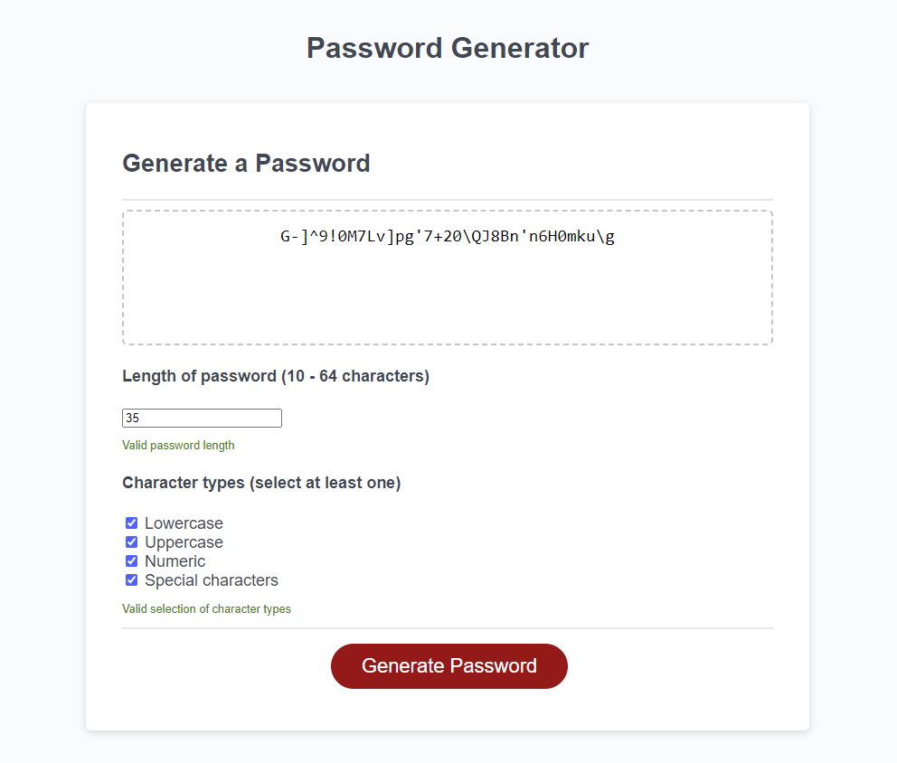

# Password-generator

Password generator using javascript, HTML & CSS

## Links

Website URL: https://georgebizzell.github.io/password-generator/

Github repo: https://github.com/georgebizzell/password-generator

## User guide

1. Access site via the URL provided.

2. Select a password length within the limits provided (10 - 64 characters).

3. Select at least one character type to be included in the password string.

4. Hit the 'Generate password' button.

## Developer guide

Please take, improve, adapt in any way.

## Next steps

1. Scroll bar for pasword length

2. Copy password option

3. Security concerns

